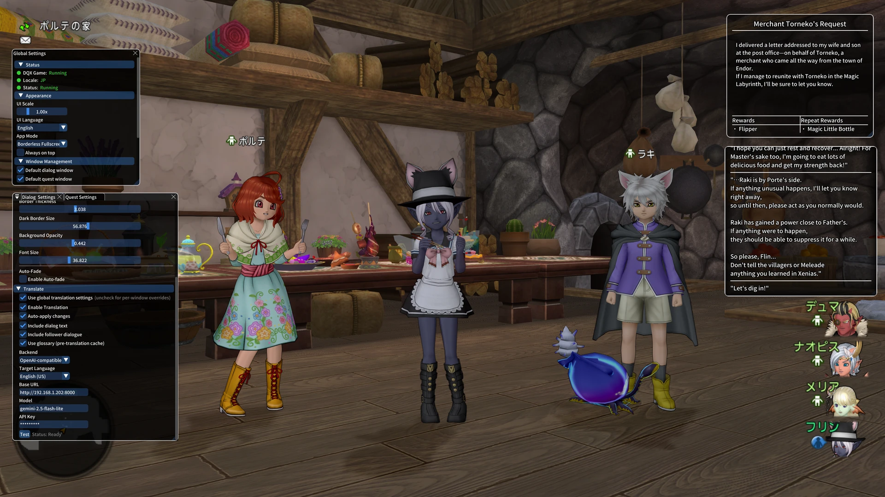

# DQX Utility

Utility for Dragon Quest X.



## Features

### Real-Time Translation From Game

- Dialog, Quest, Follower Dialogue (Right Top Corner text, mainly after version 6.x story)
- Automatically translates dialog and quest text as you play DQX
- Supports multiple translation services (OpenAI, Google, Qwen, Youdao, Niutrans, ZhipuGLM...)
- Multi-language (`en-US`, `zh-CN`, `zh-TW`) support
- Glossary system for consistent character names and game-specific terms
- Customizable Dialog and Quest translation window ui appearance
- Global/individual translation for each component

### Quest Guide System

- **Step-by-step quest walkthroughs**: Automatically detects your current quest and displays detailed instructions
- Over 800 quests included with comprehensive steps and helpful tips
- Automatic translation of quest guides to your preferred language
- Fuzzy matching to find quests even when names don't match exactly
- Quick access via "Open Guide" button in quest windows

### Monster Information System

- **Comprehensive monster database**: Click on monster names in quests or dialogs to view detailed information
- Displays monster stats (HP, MP, Attack, Defense, EXP, Gold, Training levels)
- Elemental resistances (Fire, Ice, Wind, Thunder, Earth, Dark, Light)
- Monster locations and spawn areas
- Complete drop lists including normal drops, rare drops, orbs, and treasure
- Automatic translation support for monster names and categories

## Quick Start

1. Download the latest release, Extract the archive
2. Configure your preferences and translation API keys, you have two ways: 
  a. Open the dqx-utility and right click to open setting
  b. Edit `config.toml` 
3. Run `dqx-utility.exe` (Windows) or `dqx-utility` (Linux)
4. Start Dragon Quest X and play! (you could also start dqx-utility after game launch)

## Configuration

Just right click(empty space for global setting, otherwise window specific setting) to open setting in GUI, or Edit `config.toml` to configure the application:

**Key Settings**:
- **Translation backend**: Choose your preferred translation service
- **API keys**: Add your translation service credentials
- **Window settings**: Adjust appearance, position, and behavior

**Security Note**: Keep your API keys private and never share your `config.toml` file publicly.

## Troubleshooting

**No translations appearing**
- Verify your API keys are correctly set in `config.toml`
- Check that translation is enabled in settings
- Ensure you have an active internet connection

**Application crashes**
- Check the `logs/` folder for error details
- report issue to this repo

## Building from Source

### Prerequisites

- CMake 3.20 or later
- C++20 compatible compiler (MSVC 2022+ or Clang 15+)
- Internet connection (for downloading dependencies)

### Quick Build

Check available presets:
```bash
cmake --list-presets
```

### FreeLLM API Keys (for source builds)

**Important**: Pre-built releases from GitHub include API keys for the free FreeLLM translation backend. If you build from source, you have two options:

**Option 1: Use FreeLLM (requires API keys)**

The application can still compile without FreeLLM keys, but the FreeLLM backend will show an error at runtime. To use FreeLLM when building from source, pass your own API keys via CMake:

```bash
cmake --preset <preset> \
  -DFREELLM_API_KEY_1="your_key_here" \
  -DFREELLM_API_KEY_2="your_key_here" \
  -DFREELLM_API_KEY_3="your_key_here" \
  -DFREELLM_API_KEY_4="your_key_here" \
  -DFREELLM_API_KEY_5="your_key_here" \
  -DFREELLM_API_KEY_6="your_key_here"
```

**Option 2: Use other translation backends**

You can use any of the other supported translation services (OpenAI, Google, Qwen, Youdao, Niutrans, ZhipuGLM) by configuring them in `config.toml` with your own API keys. These backends don't require build-time configuration.

**Note**: For security reasons, API keys for FreeLLM are not included in the source repository. Pre-built releases have keys embedded during the CI/CD build process.

## Privacy & Safety

- This tool reads game memory to capture text for translation
- No game data is sent anywhere except to your chosen translation service
- API keys and configuration are stored locally on your computer

## Acknowledgments

Special thanks to the [dqxclarity project](https://github.com/dqx-translation-project/dqxclarity) - the text hook extraction flow is based on their excellent work.

## License

This project is licensed under the MIT License - see the [LICENSE](LICENSE) file for details.

---

**Disclaimer**: This is a third-party tool not affiliated with Square Enix. Use at your own risk.
